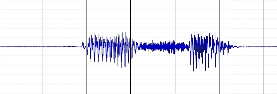

# A Preparation Toolset for WAV Files

## Trim Tool

### Functionality
Trim heading and Trailing silence.

Before:



After:


The beginning section of the processed WAV looks ugly?

Don't worry, if we zoom in, it looks like:


### Background
Most of the WAV files have heading and trailing silence ranges, either you got them from Audio Recorder or Speech Synthesis. We want to filter them sometimes.

There two existing options:

1. Skip the H&T frames with zero value in the WAV file.

2. Use librosa.effects.trim.

Disadvantage of the two: Weren't able to remove inaudible frames with tiny noise clearly enough.

### Usage
```
1. Modify 'input_path' and 'output_path' in 'script_configs.json'. Code will search for WAV files inside 'input_path'.
2. py trim_wav.py
```

### Notice
Code is written only for 16-bit WAV for now. Haven't tested with 24-bit WAV.
